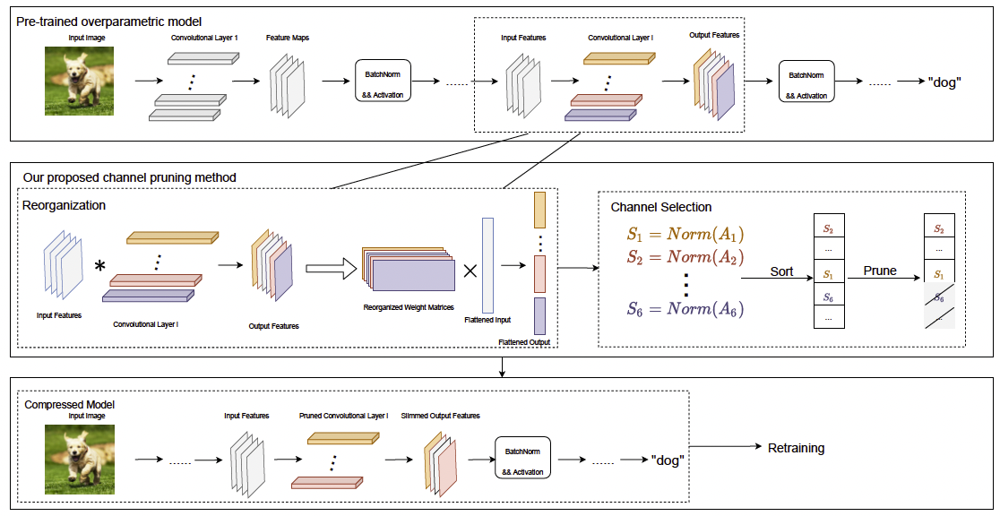

# Towards Better Structured Pruning Saliency by Reorganizing Convolution

This repository is for SPSRC method introduced in the following paper accepted by WACV2024:

Towards Better Structured Pruning Saliency by Reorganizing Convolution\
Xinglong Sun, Humphrey Shi

## Introduction
We present SPSRC, a novel, simple and effective framework
to extract enhanced Structured Pruning Saliency
scores by Reorganizing Convolution. We observe that performance
of pruning methods have gradually plateaued recently
and propose to make better use of the learned convolutional
kernel weights simply after a few steps of transformations.
We firstly re-organize the convolutional operations
between layers as matrix multiplications and then
use the singular values and the matrix norms of the transformed
matrices as saliency scores to decide what channels
to prune or keep. We show both analytically and empirically
that the long-standing kernel-norm-based channel
importance measurement, like L1 magnitude, is not precise
enough possessing a very obvious weakness of lacking spatial
saliency but can be improved with SPSRC. We conduct
extensive experiments across different settings and configurations
and compare with the counterparts without our
SPSRC along with other popular methods, observing obvious
improvements. Our code is available at: https://github.com/AlexSunNik/SPSRC/tree/main.

<div align="center">
  
  Overview of our method.
</div>

## Compute Saliency
In order to compute the importance scores following our proposed reorganization steps, run the <b>compute_saliency.py</b> file as follows:
```
python3 compute_saliency.py --model [MODEL_ARCH] --data-set [DATASET]
```
The script will compute all of Spectral, Nuclear, and Frobenious norm for the specified model architecture and dataset.

If you want to learn detail of how the transformation and the reorganization from Convolution to Matrix Multiplication is done, check the functions: <b>conv_to_mat(.), calculate_eigvs(.), calculate_nucs(.), and calculate_fros(.) from reconv.py</b>.

We also provide collected scores by us in the <b>saliency</b> folder

## Prune and Finetune
If you need to prune and finetune the model following the measured saliency scores, run one of the <b>prune_*.py</b> files. For example, to prune ResNet34, you do:
```
python3 prune_resnet34.py --metric [METRIC] --model [MODEL_ARCH] --data-set [DATASET] --prune-cfg [PRUNE_CFG] --save-path [SAVE_PATH]
```
<b>METRIC:</b> Pick one from [spec, nuc, fro]. Choose saliency from Spectral Norm, Nuclear Norm, or Frobenious Norm after reorganization.\
<b>MODEL_ARCH:</b> Pick one from [vgg16_bn, resnet34, resnet56, resnet101]\
<b>DATASET</b> Pick one from [imagenet, CIFAR10, CIFAR100]\
<b>SAVE_PATH</b> Specify where you want to save the pruned model
<!-- <b></b> -->
<!-- <b></b> -->

Notice that <b>finetuning</b> is involved when you run the above files for ResNet56, ResNet101, and VGG for the CIFAR datasets. 

In order to finetune ResNet34 on ImageNet, you need to additionally run:
```
python3 finetune_resnet34.py --refine [PATH_TO_PRUNED_MODEL]
```
## Citations
If you find this repo useful to your project or research, please cite our paper below:

@inproceedings{sun2024towards,\
  title={Towards Better Structured Pruning Saliency by Reorganizing Convolution},\
  author={Sun, Xinglong and Shi, Humphrey},\
  booktitle={Proceedings of the IEEE/CVF Winter Conference on Applications of Computer Vision},\
  pages={2204--2214},\
  year={2024}\
}